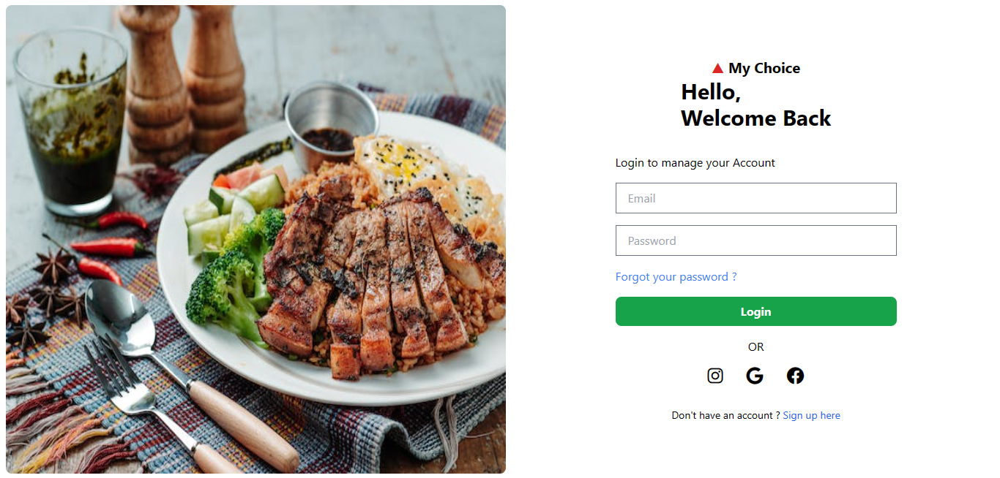

## 1st Project 

* In this project I have created the Home Page of Pw Skills (Old version). While Creating and Writing the code
  using Tailwind CSS. I really enjoyed writing the Tailwind CSS code for this Project.

* Output for Pwhome Web-page

## 2nd Project 

* Simple Login/Signup web page Using Tailwind CSS. Writing code in Tailwindcss is an Awesome Experience. 
* Learning New things and Exploring!

* Output of Form page

